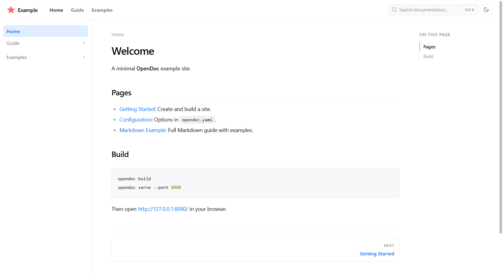
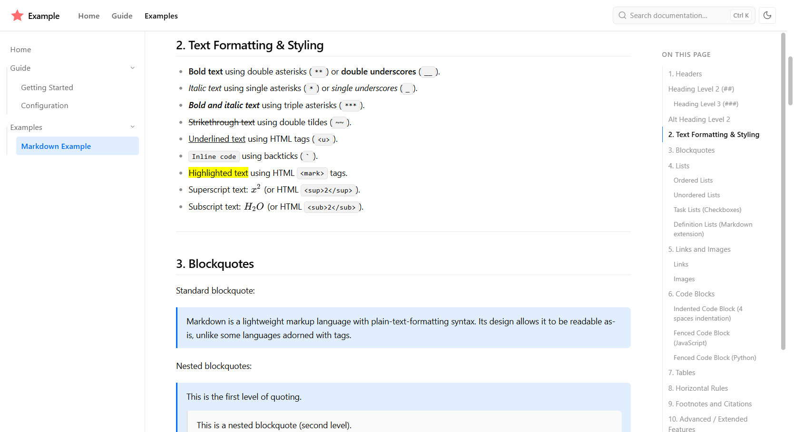
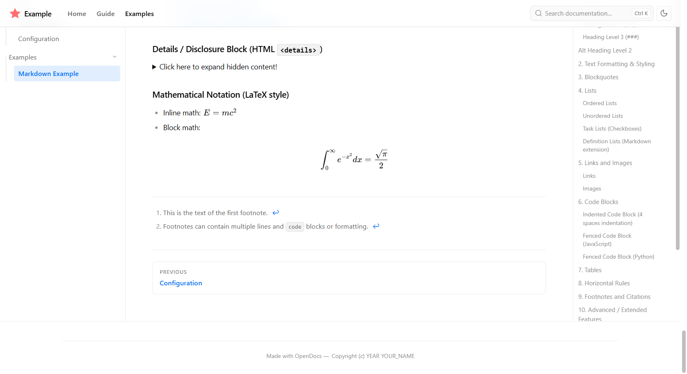
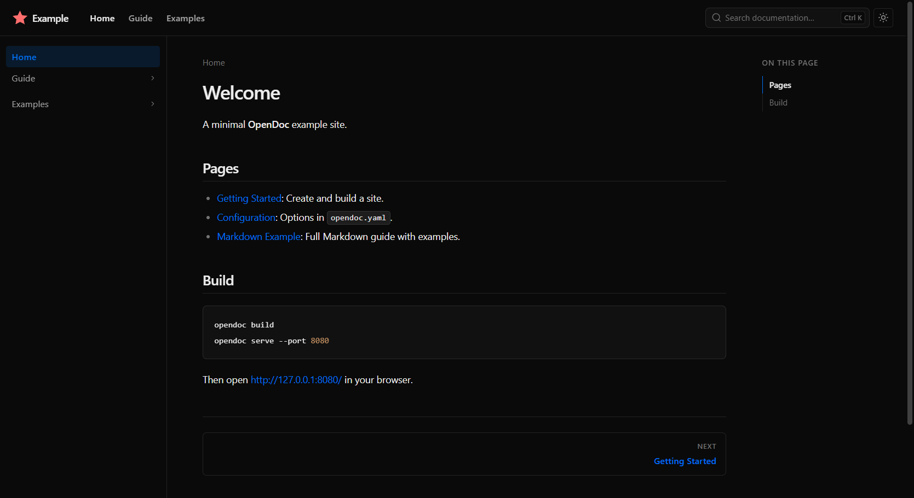
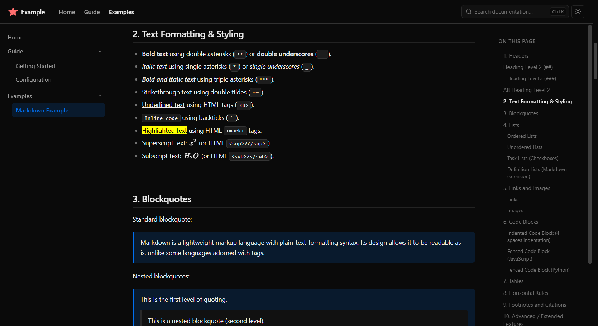
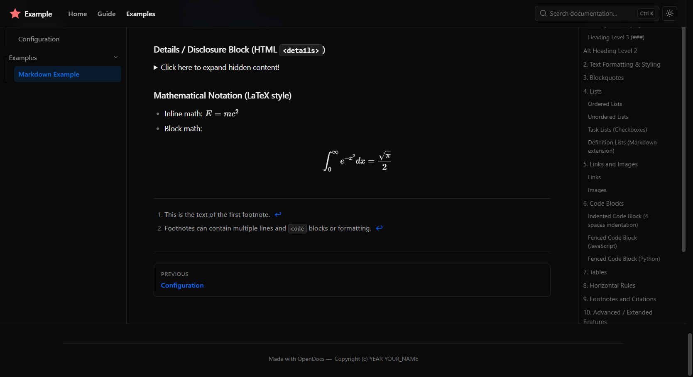

<div align="center">
    
    <p style="font-size: 20px;"><b>A High-Performance Static Site Generator Written in C++</b></p>
    <br>
</div>

**OpenDoc** is an ultra-fast and open source static site generator (SSG) designed to build project documentation
websites based on Markdown files.

> [!IMPORTANT]
> This is a highly experimental project that may fail unexpectedly or not fully complete site generation.

### How it Works

- **Markdown to HTML**: OpenDoc takes text files written in Markdown and converts them into complete HTML files based on
  themes and customization.
- **Single Configuration**: The entire website structure, navigation, and theme choice are managed through one simple
  YAML configuration file.
- **Built-in Live Preview**: It includes a local development server that rebuilds automatically when you change and
  save a file (run it with `--watch`); refresh your browser to see the update.

## Features

- **Ultra-fast and Lightweight**: OpenDoc is purely written in C++, so performance is already expected. We use our
  custom Markdown parser and local development server.
- **Built-in Search**: OpenDoc provides default plugins, including a simple and client-side search that is blazingly
  fast.
- **Themes and Customization**: You can customize your site as much as you want without any limits!
- **Extensible Ecosystem**: You can build your own plugins or install third-party plugins to add more features!

## Preview

This is a preview of a generated site built with OpenDoc, using the example at [examples/site](./examples/site) with the
default theme.

|                                                            Light Mode                                                            |                                                           Dark Mode                                                           |
|:--------------------------------------------------------------------------------------------------------------------------------:|:-----------------------------------------------------------------------------------------------------------------------------:|
| <br><br> | <br><br> |

## How to install pre-built binaries

### Provided

- **Windows 10 up to Windows 11 x86-64**: [OpenDoc-x.x.x-windows-x86_64.zip](https://github.com/OpenDocTeam/OpenDoc/releases)
- **Windows 10 up to Windows 11 ARM64**: [OpenDoc-x.x.x-windows-arm64.zip](https://github.com/OpenDocTeam/OpenDoc/releases)
- **Linux Debian Based**: [OpenDoc-x.x.x-linux-deb.zip](https://github.com/OpenDocTeam/OpenDoc/releases)

OpenDoc has been tested on **Windows 10 Build 18363**, **Latest Build of Windows 11**, and **Ubuntu 26 LTS**.

### Extract

You will have to extract the downloaded zip file to a memorable location, such as in `C:\opendoc\` (if you're on Windows).

> [!WARNING]
> The zip files are automatically compressed by a script, so some specific Windows build versions may say the compressed file is invalid, so use [7-Zip](https://www.7-zip.org/) or [WinRAR](https://www.win-rar.com/) to extract instead of Windows's default extractor.

### Adding to PATH

This is the most recommended step to take. If you want the CLI to be executable in any terminal location, you should add OpenDoc's directory to your system's PATH.

#### For Windows:

1. Extract the zip to a permanent location, e.g. `C:\opendoc\`: This is the folder that contains `opendoc.exe`.
2. Open the System Properties dialog: press <kbd>Win</kbd>+<kbd>R</kbd>, type `sysdm.cpl`, press Enter, then go to **Advanced** → **Environment Variables...**
3. Under *System variables*, select `Path`, click **Edit...**, click **New**, and type the full path to the folder (e.g. `C:\opendoc\`).
4. Close every dialog with **OK** and open a **new** terminal, then verify:

    ```powershell
    opendoc --version
    ```

#### For Linux:

1. Extract the zip to a permanent location (the archive keeps the executable permission):

    ```bash
    unzip OpenDoc-x.x.x-linux-deb.zip -d ~/.local/opendoc
    ```

2. Add the folder to your `PATH` by appending this line to `~/.bashrc` (or `~/.profile` if your terminal starts a login shell):

    ```bash
    export PATH="$HOME/.local/opendoc:$PATH"
    ```

3. Reload the shell and verify:

    ```bash
    source ~/.bashrc
    opendoc --version
    ```

If your archive manager dropped the executable permission, restore it with: `chmod +x ~/.local/opendoc/opendoc`

## Requirements

| Dependency   | Version | Notes                                  |
|--------------|:-------:|----------------------------------------|
| CMake        |  3.20+  | Build system generator                 |
| C++ compiler |  C++20  | GCC 10+, Clang 12+, or MSVC 19.29+     |
| yaml-cpp     |   any   | Configuration                          |
| Ninja        |   any   | Recommended generator; Make also works |

### Windows

- **Networking**: Links against `ws2_32` (Winsock).
- **Dependencies**: Requires the shared SDK (`libopendoc_sdk.dll`) and `yaml-cpp` beside the executable (or on `PATH`). The pre-built zip already contains every required DLL, so no extra installs are needed.

### Linux & POSIX Systems

- **Networking**: Uses native BSD sockets.
- **Dependencies**: Requires the shared SDK (`libopendoc_sdk.so` / `.dylib`) and `yaml-cpp` at runtime. The pre-built zip ships `yaml-cpp` statically linked and resolves the shared SDK from its own folder, so no extra packages are needed.

## Building From Source

```bash
git clone https://github.com/OpenDocTeam/OpenDoc.git
cd OpenDoc

cmake -S . -B build -G Ninja -DCMAKE_BUILD_TYPE=Release
cmake --build build
```

This produces `build/opendoc` (`opendoc.exe` on Windows), the generator executable, and `build/libopendoc_sdk.dll`, the
shared SDK.

Add the `build/` directory to your system `PATH` so the CLI and shared library resolve from any terminal location.

## Quick Start

Create a project directory with a config file and a `docs/` folder:

```text
my-project/
├── opendoc.yaml
└── docs/
    └── index.md
```

### Create `opendoc.yaml`:

This is the config file for OpenDoc. In this file, you can customize your site as much as you want!

```yaml
site_name: My Docs
docs_dir: docs
site_dir: site
nav:
  - Home: index.md
```

### Create `docs/index.md`:

This is the entry point of your documentation. Every time a user visits your site, this file will be the first page to
be shown.

```markdown
# Hello OpenDoc!

This is my **first** page.

I use [OpenDoc](https://github.com/OpenDocTeam)!
```

### Build and preview:

The following commands will build your site into HTML files, then OpenDoc will serve the site locally so you can preview
it without the need to deploy!

```bash
cd my-project
opendoc build
opendoc serve --port 8080
```

Once you run the commands without any errors, open <http://127.0.0.1:8080/> in your browser.

## Command Line Interface

```text
OpenDoc: A high-performance static site generator written in C++.

Usage:
  opendoc build [options]     Build the site
  opendoc serve [options]     Build and serve locally
  opendoc --help              Show help
  opendoc --version           Show version

Options:
  -c, --config <file>         global: Configuration path (default: opendoc.yaml)
  --strict                    global: Treat build warnings as errors
  --quiet                     global: Suppress informational output
  --host <addr>               serve: Bind address (default: 127.0.0.1)
  --port <port>               serve: Port (default: 8000)
  --no-build                  serve: Skip initial build
  --watch                     build/serve: Rebuild when docs or config change
```

See [the guide](./GUIDE.md#2-command-line-reference-cli) for the full reference, including flag aliases and validation
rules.

## Acknowledgements & AI Assistance

Parts of this project were built with the assistance of AI (specifically regarding UI layout structure, the Markdown
parser implementation, and the local server). The usage of AI helped the development of this project, and I (the author)
have to be honest with all users of OpenDoc.

All generated code has been manually reviewed and tested before making any commit.

## License & Contributing

This project is open-source under the [MIT License](./LICENSE), meaning you are completely free to view, fork, and
modify the codebase for your own use.

Contributions are welcome! Please read [`CONTRIBUTING.md`](./CONTRIBUTING.md) and then feel free to make a pull request.

## See Also

- [**Guide**](./GUIDE.md): Full guide of OpenDoc usage.
- [**Plugins**](./PLUGINS.md): Full guide of developing OpenDoc plugins and themes.
- [**Code of Conduct**](./CODE_OF_CONDUCT.md): The community standards.
